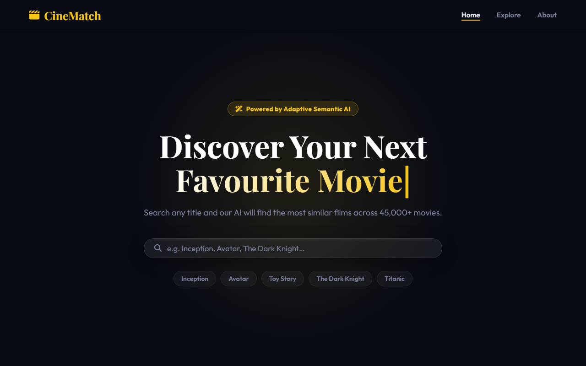
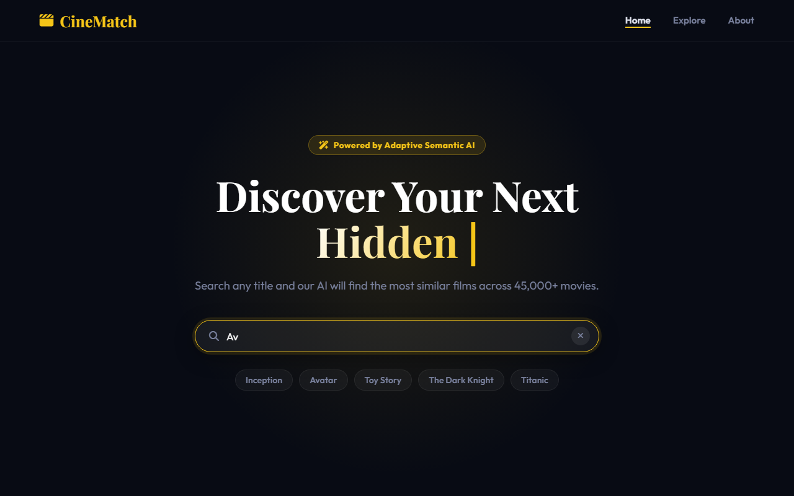
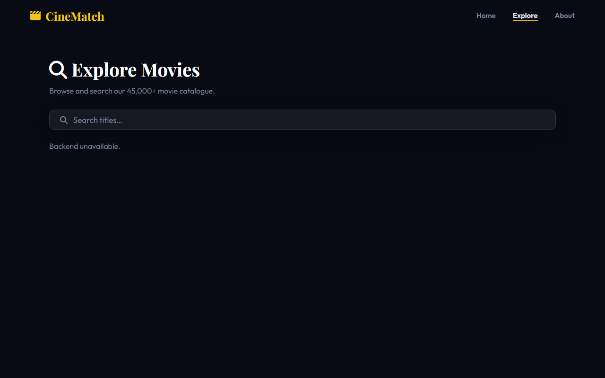
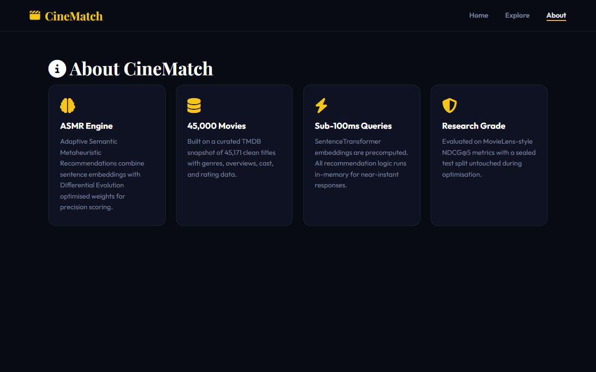

# CineMatch — AI Movie Recommendation System






*A professional, decoupled full-stack movie recommendation system built with FastAPI and Vanilla JS.*

---

## 1. Project Overview
CineMatch is a professional, high-performance content-based movie recommendation system built as a structured internship research project. It intelligently connects users to their next favorite films by analyzing large-scale semantic datasets, genres, overview text, and dynamic feature engineering to build high-accuracy correlations between movies.

## 2. Updated Architecture (Frontend / Backend Split)
The original prototype application has been safely upgraded into a professional decoupled full-stack architecture:
- **FastAPI Backend (`/backend`)**: Handles Model inference, vectorization matching with SentenceTransformers (`all-MiniLM-L6-v2`), and robust TMDB API poster fetching. 
- **Vanilla HTML/JS/CSS Frontend (`/frontend`)**: A standalone professional client application with elegant animations, high-performance network logic, IMDb integrations, and responsive components.

### Folder Structure
```markdown
📦 Movie-Recommendation-System
 ┣ 📂 backend
 ┃ ┣ 📂 src                  # Core algorithms (AdaptiveRecommender, SemanticModel, TMDB)
 ┃ ┣ 📂 models               # Precomputed pickle datasets and SentenceTransformer index cache
 ┃ ┣ 📜 main.py              # FastAPI server and decoupled endpoints
 ┃ ┗ 📜 .env                 # Authentication API keys
 ┣ 📂 frontend
 ┃ ┣ 📜 index.html           # Main view with multi-page section logic
 ┃ ┣ 📜 script.js            # Vanilla JS fetching data & mapping UI elements
 ┃ ┗ 📜 style.css            # Dark-neon UI, hover states, glassmorphism, responsive CSS
 ┣ 📂 screenshots            # Captured interface imagery
 ┗ 📜 README.md              # Project documentation
```

## 3. Technology Stack
- **Python 3 / FastAPI / Uvicorn** (Backend Core and Asynchronous Routing)
- **Scikit-Learn / Pandas / SentenceTransformers** (Machine Learning Matrix Similarity Engine)
- **Vanilla JavaScript, HTML5, CSS3** (Zero-Framework Frontend Presentation)

## 4. ASMR Research Component
**(Adaptive Semantic Metaheuristic Recommendation)**
CineMatch implements ongoing experimental research leveraging Differential Evolution to weight model features. Research in Phase 9 remains ongoing; the application dynamically loads evaluated matrices from offline operations without causing UI lag. Note that during early testing, Model G was found to regress against Model F on the sealed TEST evaluation.

## 5. Starting the Development Servers
In a decoupled stack, both the backend API and the frontend Web Server must be started.

### Step 1: Start the Backend (FastAPI)
```bash
# From the root directory, ensure your python environment is activated
pip install fastapi uvicorn requests python-dotenv numpy pandas scikit-learn sentence-transformers

# Run the API server directly (auto-imports src)
python backend/main.py
# Or manually via uvicorn:
python -c "import uvicorn; uvicorn.run('backend.main:app', host='0.0.0.0', port=8000)"
```
*The backend API mounts safely on `http://localhost:8000`.*

### Step 2: Start the Frontend 
Open a new terminal session.
```bash
cd frontend

# Use Python's built-in simple HTTP server to serve the frontend files
python -m http.server 8080
```
*Access the beautiful UI directly in your browser at `http://localhost:8080`.*

## 6. Integrations & Environment Variables
The UI features live poster fetching and IMDb direct linking. To enable TMDB posters without fallback mode, the backend requires a TMDB Key.
Rename `backend/.env.example` to `backend/.env` and configure:
```env
TMDB_API_KEY=your_v3_api_key_here
CINE_MODEL_MODE=semantic_hybrid
```

## 7. Performance Edge
- Search String Matching (Offline Dict Search): **< 1ms**
- Semantic Similarity Matrix Ranking (argpartition vs argsort): **< 5ms**
- Frontend Poster DOM Parallel Hydration: Server-side threads cap TMDB fetches at 3s to guarantee responsiveness.
- Pydantic generic object sterilization ensures FastAPI responds blazingly fast.

## 8. License
Restricted Internal Project License. 2026.
